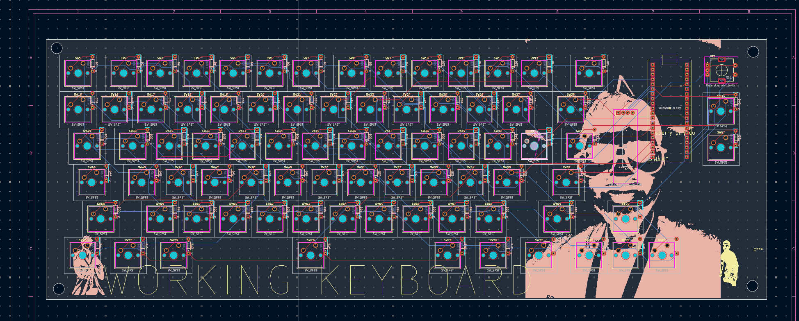
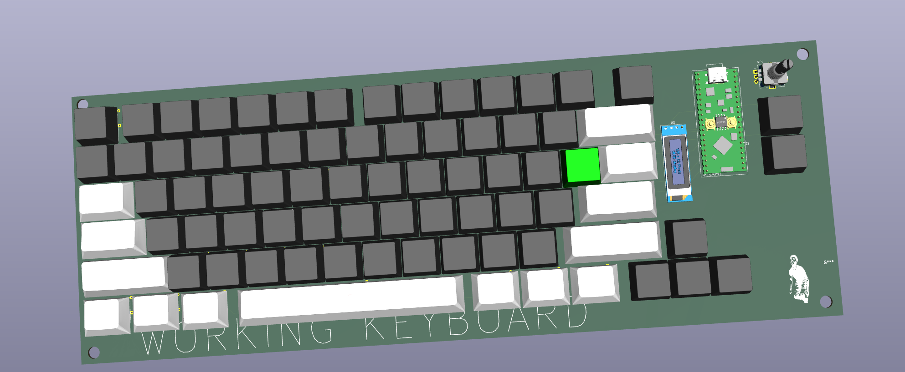
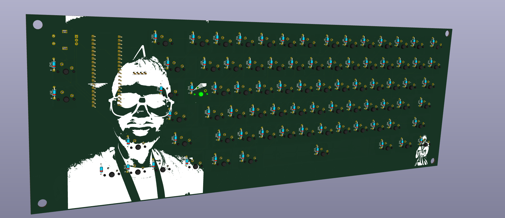
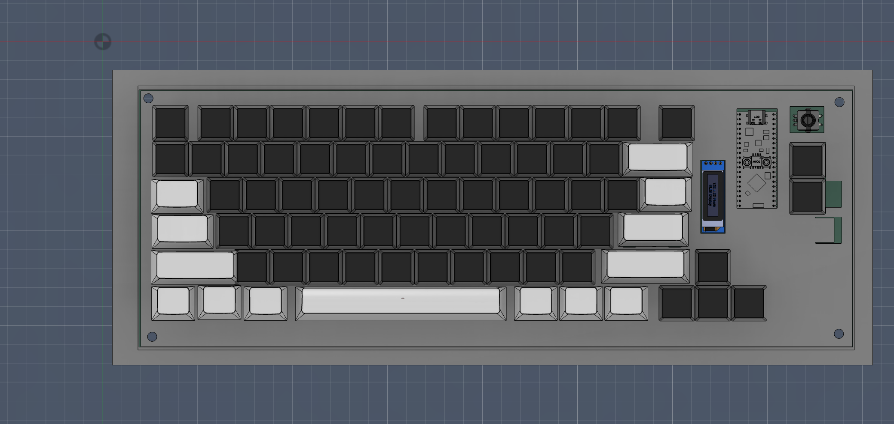
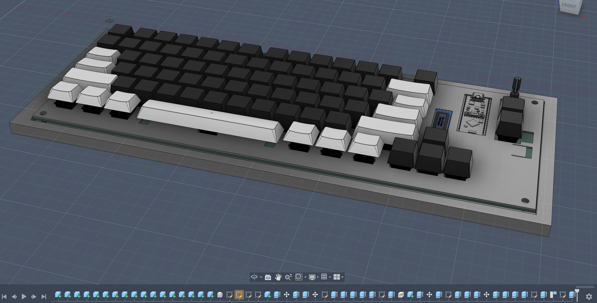

# keyboard


Custom mechanical keyboard PCB designed using KiCad.

## Images

### PCB


### PCB Front 3D


### PCB Back 3D


### 3D Model 1


### 3D Model 2


---

## Features

- Custom Keyboard PCB
- Designed in KiCad
- 3D PCB Visualization
- Gerber Manufacturing Files Included

---

## Repository Structure

```text
keyboard/
│
├── code/
├── image/
├── kicad/
├── grb.zip
└── README.md
```

---

## Files

- `code/` → Firmware / keyboard code
- `image/` → PCB renders and 3D models
- `kicad/` → KiCad project files
- `grb.zip` → Gerber files for PCB manufacturing

---

## Author

Created by [AYUSH-pro-grammer](https://github.com/AYUSH-pro-grammer)
