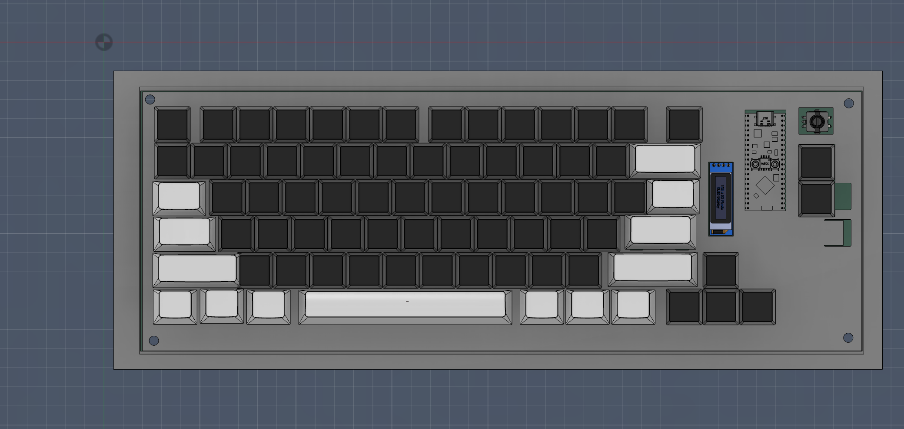
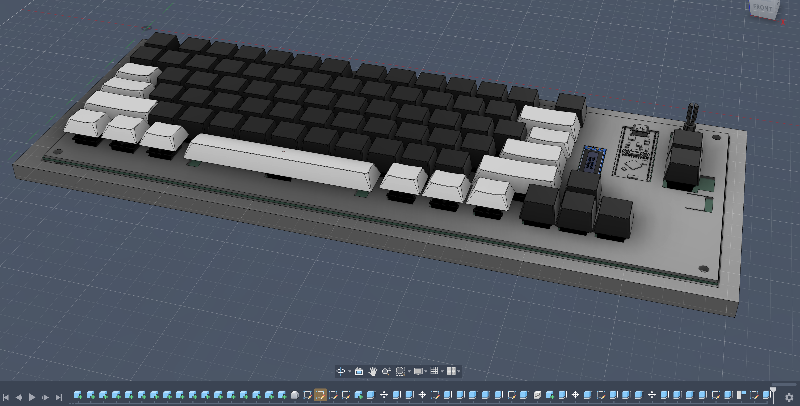

# keyboard


Custom mechanical keyboard PCB designed using KiCad.

###Motivation

I designed this device in order to get some practical experience in hardware design, PCB manufacturing, and embedded systems programming. Instead of using an off-the-shelf keyboard design, I aimed at learning all the steps required to manufacture a custom keyboard.

Working on this project, I had the opportunity to do schematic design, PCB layouting, components selection, 3D rendering, firmware writing, and manufacturing preparation with the help of KiCad. Thus, having successfully completed the whole design cycle, I got some practical experience in both hardware and software engineering.

It was my intention not only to manufacture a working device but also learn some electronics designing techniques along with problem solving in the engineering field while doing a project that is manufacturable and improvable in the future.

## Images

### Schematic


### PCB


### PCB Front 3D


### PCB Back 3D


### 3D Model 1


### 3D Model 2


---

## Features

- Custom Keyboard PCB
- Designed in KiCad
- 3D PCB Visualization
- Gerber Manufacturing Files Included

---

## Repository Structure

```text
keyboard/
│
├── code/
├── image/
├── kicad/
├── grb.zip
└── README.md
```

---

## Files

- `code/` → Firmware / keyboard code
- `image/` → PCB renders and 3D models
- `kicad/` → KiCad project files
- `grb.zip` → Gerber files for PCB manufacturing

---

## Bill of Materials (BOM)

| Name | Purpose | Quantity | Total Cost (USD) | Link | Distributor |
|------|----------|----------|------------------|------|-------------|
| Cherry MX2A Switch Set | To make the buttons work | 1 | $42.00 | https://keychron.in/product/cherry-mx2a-switch-set/ | Keychron |
| Keycaps | To mount above the MX switches | 1 | $12.60 | https://meckeys.com/shop/accessories/keyboard-accessories/keycaps/cherry-colour-pbt-keycap-set/ | Meckeys |
| PCB | PCB fabrication | 1 | $59.00 | https://robu.in/ | Robu.in |

### Total Estimated Cost

**$113.60 USD**

## Author

Created by [AYUSH-pro-grammer](https://github.com/AYUSH-pro-grammer)
